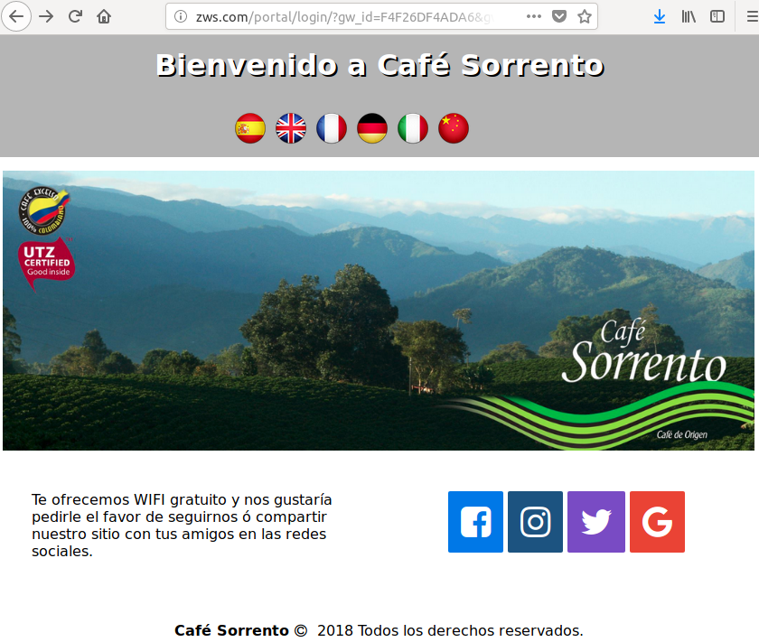
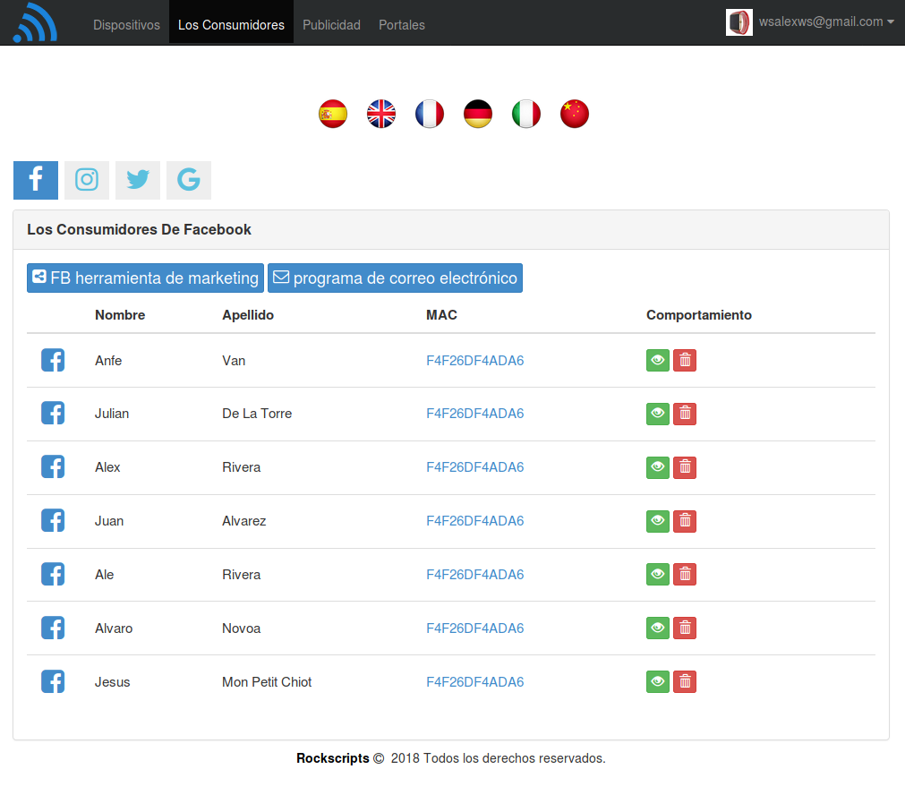

<h1>Zona Wifi Social</h1>

Crea Hot spots con portales cautivos para ofrecer Internet con conexión a través de redes sociales. Incluye panel de administración tanto para cliente y administrador.

<h4>Portal Cautivo</h4>

<h4>Administrador</h4>

<h1>PROYECTO QUE USA EL ADMINISTRADOR</h1>

Gracias a este proyecto se comleta el portal cautivo y conecta con la app de administración. 
<a href='https://github.com/mhaas/fbwlan' target='_blank'>fbwlan</a> 
 
Licencia: AGPL

